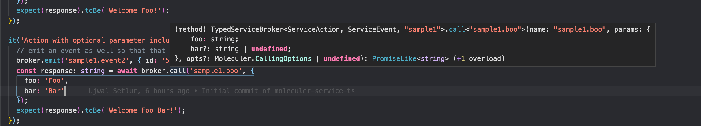

# moleculer-service-ts
Typescript support for moleculer service actions and events


## Installation

```bash
npm install moleculer-service-ts
```

## Use

Define actions you handle and events you emit in your service in a ```<service>.service.types.ts``` file:

Example sample1.service.types.ts:

```ts
import {
  GenericActionWithParameters,
  GenericActionWithoutParameters,
  GenericEventWithoutPayload,
  GenericEventWithPayload
} from 'moleculer-service-ts'; // eslint-disable-line import/extensions

export type ServiceName = 'sample1';

export type ServiceAction =
  | GenericActionWithoutParameters<'sample1.hello', string>
  | GenericActionWithParameters<
      'sample1.boo',
      { foo: string; bar?: string },
      string
    >
  | GenericActionWithParameters<
      'sample1.welcome',
      { name: string },
      string
    >;

export type ServiceEvent =
  | GenericEventWithoutPayload<'sample1.event1'>
  | GenericEventWithPayload<'sample1.event2', { id: string }>;
```

Example sample2.service.types.ts:
```ts
import {
  GenericActionWithParameters,
  GenericActionWithoutParameters,
  GenericEventWithoutPayload,
  GenericEventWithPayload
} from 'moleculer-service-ts'; // eslint-disable-line import/extensions

export type ServiceName = 'sample2';

export type ServiceAction =
  | GenericActionWithoutParameters<'sample2.hello', string>
  | GenericActionWithParameters<
      'sample2.boo',
      { foo: string; bar?: string },
      string
    >
  | GenericActionWithParameters<
      'sample2.welcome',
      { name: string },
      string
    >;

export type ServiceEvent =
  | GenericEventWithoutPayload<'sample2.event1'>
  | GenericEventWithPayload<'sample2.event2', { id: string }>;
```

Then, when you want to call actions and emit events, you import the type definitions and feed them to a typed moleculer broker from this package:

main.ts:

```ts
import { TypedServiceBroker } from 'moleculer-service-ts'; // eslint-disable-line import/extensions

// import the service types from sample1 service
import {
  ServiceAction as Sample1Action,
  ServiceEvent as Sample1Event,
  ServiceName as Sample1Name
} from './sample1.service.types'; // eslint-disable-line import/extensions

// import the actual service schema of the sample1 service
import sample1 from './sample1.service'; // eslint-disable-line import/extensions

// import the service types from sample2 service
import {
  ServiceAction as Sample2Action,
  ServiceEvent as Sample2Event,
  ServiceName as Sample2Name
} from './sample2.service.types'; // eslint-disable-line import/extensions

// import the actual service schema of the sample2 service
import sample2 from './sample2.service'; // eslint-disable-line import/extensions

// build union of types
type ServiceAction = Sample1Action | Sample2Action;
type ServiceEvent = Sample1Event | Sample2Event;
type ServiceName = Sample1Name | Sample2Name;

// create the typed broker
const broker: TypedServiceBroker<
    ServiceAction,
    ServiceEvent,
    ServiceName
  > = new TypedServiceBroker<
    ServiceAction,
    ServiceEvent,
    ServiceName
  >({ logLevel: 'info' });

// create the services and start the broker
broker.createService(sample1);
broker.createService(sample2);
broker.start();

// now the broker call/emit methods are typescript aware to your specific services
broker.emit('sample1.event2', { id: '1234' }); // no typescript error

broker.emit('sample1.event2'); // typescript error since arguments are expected

broker.emit('sample1.event2', { id: 1234 }); // typescript error since arguments are of wrong type

broker.call('sample1.hello'); // no typescript error

broker.call('sample1.hello', {}); // typescript error since this action does not take an argument

broker.call('sample1.welcome', {
      name: 'John'
    }); // no typescript error

broker.call('sample1.welcome'); // typescript error since arguments are expected

broker.call('sample1.welcome', {
      id: 1234
    }); // typescript error since wrong type of arguments are supplied

const result: PromiseLike<number> = broker.call('sample1.welcome', {
      name: 'John'
    }); // typescript error since return type is different
```

On VS Code and other typescript aware IDEs, code intellisense should work:

<p align="center">

</p>

<p align="center">

</p>

<p align="center">

</p>
